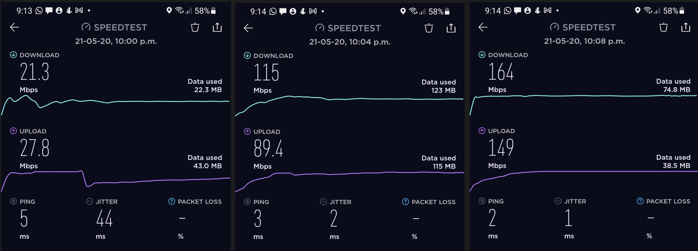

# Hardwired Bell Pods

I've recently noticed that the popularity of ISP provided mesh systems here in Canada, with two large ones being the [Bell Wifi Pods](https://www.bell.ca/Bell_Internet/Products/Wifi) (2 for $10/month) and the [Rogers Ignite wifi pods](https://www.rogers.com/customer/support/article/how-to-setup-ignite-wifi-pod)(generally included for free).

I've seen a lot of these installed in new development homes that are already pre-wired with Cat5e or Cat6, and thought, there sure is a better way then using these as a repeater type device.

Come to find out, there is. According to Plume's [Do hardwired pods improve Wi-Fi performance?](https://support.plume.com/hc/en-us/articles/115002331007-Does-hardwiring-pods-improve-Wi-Fi-performance-) they support something more similar to an access point mode! Even thought most telecom representatives aren't aware of this, and will tell you that you can't.

So, I thought I would give it a try.

The premise is really simple:

1. Unplug the Pod
2. Connect it to a network cable that is connected to your router/switch
3. Plug the pod back into power

Did it help? Yes! Well to begin, the pods by themselves did a terrific job, bringing an area with about a 20/20 connection to about 120/100. After hard wiring the pod, the full 150/150 connection speed was achieved.

The take away is: if you have bad coverage and just want a plug and play solution, the bell wifi pods aren't bad. And hard wiring them will just make them work better. These are especially good for people who don't want to go through the effort or expense of a more proper network install.

Side note for pods that have a second rj45 jack: you can use the second jack as a "pass-through" to plug in your computer, tv, games console, etc...