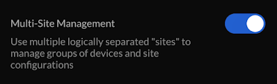
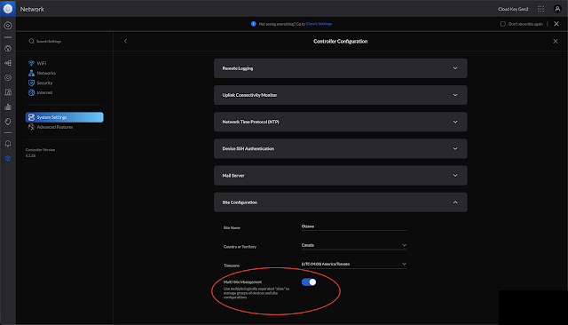

# Re-enabling multiple sites on the Cloud Key

Ubuqiti decided to disable multiple sites by default starting around Unifi Network controller 6.2.26.

Here is a simple guide on how to re-enable it considering, it is really hard to find any information on how to do so.
1. Log into the Cloud Key
2. Go to settings 
3. If using the old Network interface 
    1. User Interface
    2. New User Interface. > on
   1. Apply Changes
4. System Settings
5. Controller Configuration
6. Site Configuration
7. Multi-Site Management > on
8. Apply Changes

And you're done. I'm really not sure why this isn't enabled by default.